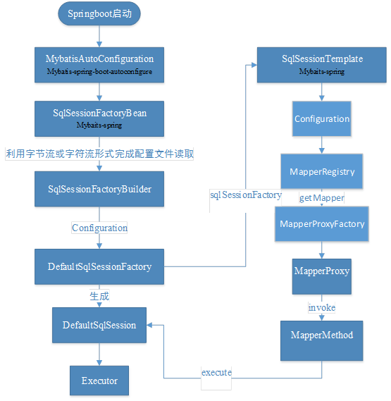

# 引言
`题外话`：idea中使用ctrl+H可以看类集成关系图，很实用

MyBatis使用简单的 XML或注解用于配置和原始映射，将接口和 Java 的POJOs（Plain Ordinary Java Objects，普通的 Java对象）映射成数据库中的记录，也可以将数据库中的数据映射成功java中的POJOs。一般Mybatis功能可以分为三层
（1）API接口层：作为最上层的处理层，它很形象的对应了数据库的增删改查操作，开发人员可通过API操作数据库
（2）数据处理层：负责SQL解析、SQL执行和执行结果映射
（3）基础支撑层：负责连接管理、事务管理、配置加载和缓存处理，这些都是公用的东西，将他们抽取出来作为最基础的组件为上层数据处理层提供最基础的支撑。springboot启动Mybatis（3.4.6）加载流程如下所示：

# 一、 Configuration相关
Configuration内部需要配置Environment环境、TransactionFactory事务工厂、ObjectFactory对象工厂、ObjectWrapperFactory对象包装工厂、MapperRegistry映射注册机、ProxyFactory代理工厂，可以算是整个mybatis的基础也是核心。
## 1.1 Configuration基础信息
### 1.1.1Environment
（1）配置环境id，即环境名称
（2）配置事务工厂TransactionFactory
（3）配置数据源DataSource，每个环境对应一个数据源，DataSource在数据库连接池相关源码阅读中再进行深入学习。
Environment.Builder environmentBuilder = new Environment.Builder(id).transactionFactory(txFactory).dataSource(dataSource);
### 1.1.2 AutoMappingBehavior
   AutoMappingBehavior内部含有3中枚举类型NONE：表示不启用自动映射，PARTIAL：表示只对非嵌套的结果集进行自动映射，FULL：表示对所有的结果集进行自动映射，默认设置为PARTIAL，即将非嵌套的结果集映射成类对象。
### 1.1.3 ExecutorType
ExecutorType为执行器类型枚举，包含三个枚举值：SIMPLE、REUSE、BATCH，SIMPLE：表示这个执行器为简单执行器，不做特殊的事情，它为每个语句执行创建一个新的预处理语句；REUSE：表示这个执行器类型会复用预处理语句；BATCH：表示这个执行器会批量执行所有更新语句，如果SELECT在它们中间执行还会标定它们是必须的，来保证一个简单并易于理解的行为。默认采用SIMPLE。
### 1.1.4LocalCacheScope
LocalCacheScope包含两个枚举值：SESSION、STATEMENT，SESSION：表示会缓存一个会话执行中的所有查询，STATEMENT：表示本地会话仅用在语句执行上，对相同的SqlSession的不用调用将不会共享数据。利用本地缓存机制防止循环引用和加速重复的嵌套查询，默认采用SESSION。
### 1.1.5 TransactionIsolationLevel
TransactionIsolationLevel为事务的隔离等级，内部含有5种枚举类型NONE、READ_COMMITTED、READ_UNCOMMITTED、REPEATABLE_READ、SERIALIZABLE。NONE表示不设置事务隔离，READ_UNCOMMITTED表示一个事务可以读取另一个事务未提交的数据；READ_COMMITTED表示一个事务要等另一个事务提交后才能读取数据；REPEATABLE_READ表示事务从读取数据时就不在允许修改操作；SERIALIZABLE为最高级别的事务隔离级别，在该级别下，事务串行化顺序执行，可以避免脏读、不可重复读、以及幻读，但是这种隔离机制性能较低，比较耗损数据库性能，使用情形较少。
### 1.1.6 JdbcType
JdbcType对java.sql中的枚举进行了包装，默认jdbcTypeForNull设置为OTHER。
## 1.2Configuration中的工厂 
### 1.2.1 ObjectFactory
（1）对象工厂，用于生产对象。该接口拥有4个方法：
//设置属性
void setProperties(Properties properties);
//使用默认的构造器生产对象
<T> T create(Class<T> type);
//使用指定的构造器，通过指定对应的参数类型寻找构造器
<T> T create(Class<T> type, List<Class<?>> constructorArgTypes, List<Object> constructorArgs);
//判断对象是否为Collection
<T> boolean isCollection(Class<T> type);
（2）DefaultObjectFactory为对象工厂的默认实现类，我们来查看一下它是怎么创建实体类的
``` java
 public <T> T create(Class<T> type, List<Class<?>> constructorArgTypes, List<Object> constructorArgs) {
    //1.根据接口创建具体的类
    Class<?> classToCreate = resolveInterface(type);
    //2.获取接口映射的类型之后转成具体对象实例 
    return (T) instantiateClass(classToCreate, constructorArgTypes, constructorArgs);
  }

 //1.将接口类型转成类的type
  protected Class<?> resolveInterface(Class<?> type) {
    Class<?> classToCreate;
    if (type == List.class || type == Collection.class || type == Iterable.class) {
        //List|Collection|Iterable-->ArrayList
      classToCreate = ArrayList.class;
    } else if (type == Map.class) {
        //Map->HashMap
      classToCreate = HashMap.class;
    } else if (type == SortedSet.class) { // issue #510 Collections Support
        //SortedSet->TreeSet
      classToCreate = TreeSet.class;
    } else if (type == Set.class) {
        //Set->HashSet
      classToCreate = HashSet.class;
    } else {
        //除此以外，就用原来的类型
      classToCreate = type;
    }
    return classToCreate;
  }

//2.获取接口映射的类型之后转成具体对象实例
private <T> T instantiateClass(Class<T> type, List<Class<?>> constructorArgTypes, List<Object> constructorArgs) {
    try {
      Constructor<T> constructor;
      //如果没有传入constructor，调用空构造函数，核心是调用Constructor.newInstance
      if (constructorArgTypes == null || constructorArgs == null) {
        constructor = type.getDeclaredConstructor();
        if (!constructor.isAccessible()) {
          constructor.setAccessible(true);
        }
        return constructor.newInstance();
      }
      //如果传入constructor，调用传入的构造函数，核心是调用Constructor.newInstance
      constructor = type.getDeclaredConstructor(constructorArgTypes.toArray(new Class[constructorArgTypes.size()]));
      if (!constructor.isAccessible()) {
        constructor.setAccessible(true);
      }
      return constructor.newInstance(constructorArgs.toArray(new Object[constructorArgs.size()]));
    } catch (Exception e) {
        //如果出错，包装一下，重新抛出自己的异常
      StringBuilder argTypes = new StringBuilder();
      if (constructorArgTypes != null) {
        for (Class<?> argType : constructorArgTypes) {
          argTypes.append(argType.getSimpleName());
          argTypes.append(",");
        }
      }
      StringBuilder argValues = new StringBuilder();
      if (constructorArgs != null) {
        for (Object argValue : constructorArgs) {
          argValues.append(String.valueOf(argValue));
          argValues.append(",");
        }
      }
      throw new ReflectionException("Error instantiating " + type +
        " with invalid types (" + argTypes + ") or values (" + argValues + "). Cause: " + e, e);
    }
  }
```
### 1.2.2 ObjectWrapperFactory
对象包装器工厂，用于获取对象包装器或判断对象是否存在包装器。默认采用DefaultObjectWrapperFactory,它默认对象没有包装器，且不支持获取包装器。先不展开学习，将放在后面的反射学习中。
（1）ObjectWrapper对象包装器
（2）MetaObject元对象
### 1.2.3 ProxyFactory
代理工厂接口，拥有两个方法，设置参数和创建代理，先不展开学习，将放在后面的执行器学习中。
（1）CglibProxyFactory：cglib延迟加载代理工厂
（2）JavassistProxyFactory：javassist延迟加载代理工厂，默认采用JavassistProxyFactory。
## 1.3Configuration中的注册机
### 1.3.1 TypeHandlerRegistry类型处理器注册机
用于提供类型注册，在学习type包的时候详细展开
### 1.3.2 TypeAliasRegistry类型别名注册机
注意类型别名全是小写字母，不是驼峰，因为部分地区的大写字母存在不一致的情况。整个类很简单以至于不需要展开学习，看一遍就行了。
### 1.3.3 LanguageDriverRegistry语言驱动注册机
一开始会注入两个语言驱动，XMLLanguageDriver和RawLanguageDriver，并且XMLLanguageDriver设置为默认的驱动，驱动必须继承自接口LanguageDriver。后续在学习scripting时将详细展开。
### 1.3.4 MapperRegistry映射注册机
涉及到了MapperProxy（映射器代理，代理模式）和MapperProxyFactory（映射器代理工厂），MapperAnnotationBuilder（映射注解构建器），MapperMethod（映射器方法）等等。后续在学习binding和builder以及annotations包时再进行展开。


原创文章转载请标明出处
更多文章请查看 
[http://www.canfeng.xyz](http://www.canfeng.xyz)